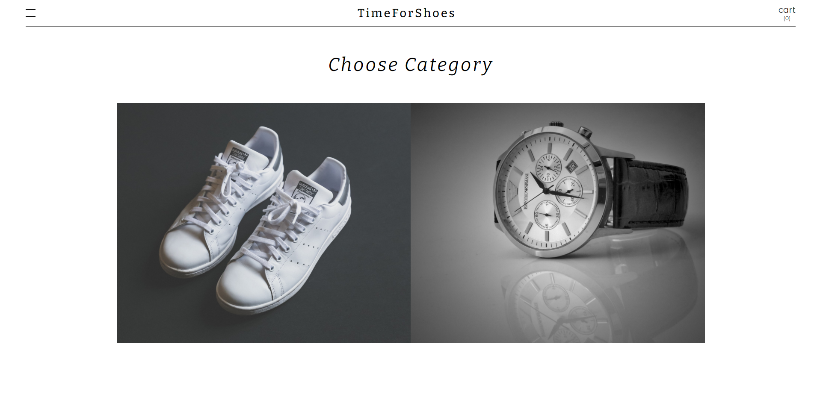
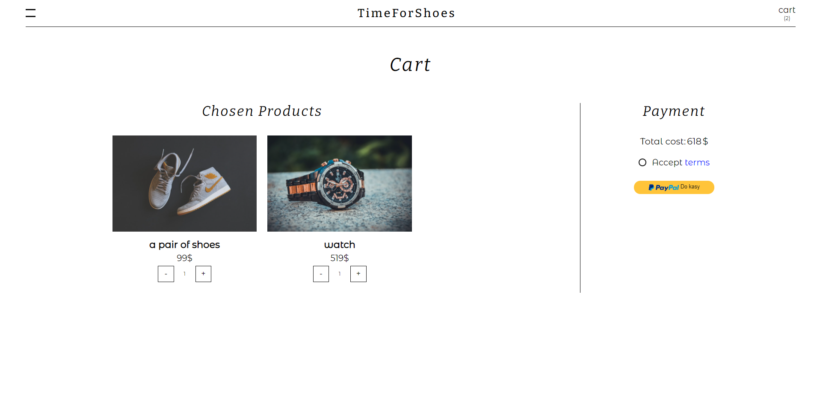
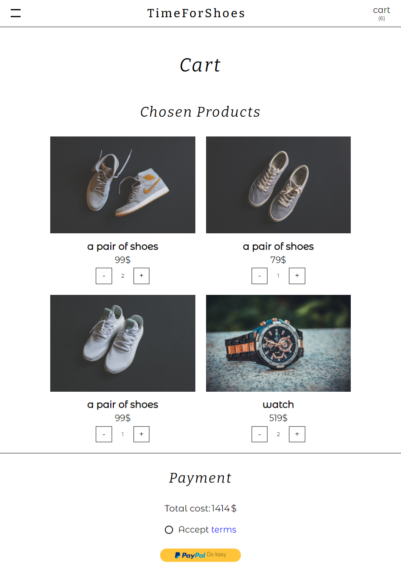
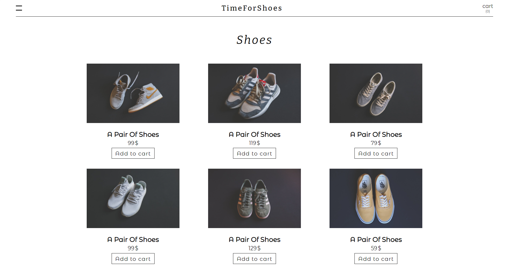
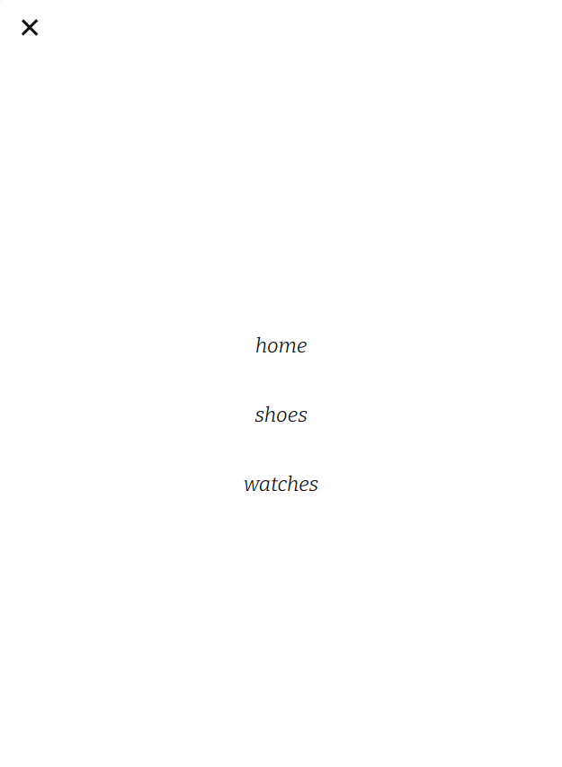

# TimeForShoes

[live](https://angry-blackwell-8c398a.netlify.app)

## Views:

### home page:

### cart:

### cart (mobile devices):

### products section (shoes):

### navigation:

## Functionality:
### navbar:

-burger icon opens navigation

-logo carries user to home page

-shopping bag icon carries user to cart

-shopping bag icon has counter with amount of items that are currently located in cart

### navigation:

-'home' carries user to home page

-'shoes' carries user to products section (shoes)

-'watches' carries user to products section (watches) 

### home page: 

-user can visit products section(shoes/watches) by clicking on proper image

### details page

-after clicking on 'Add to cart' button, product will be added to cart, and button will change its text to 'In cart'

### cart:
-cart shows products that have been added to cart

-user can increase and decrease amount of products

-total value 

-paypal sandbox

-if there are no products in cart, user will see "YOUR CART IS EMPTY" instead

### others:

-if user passes wrong path, component NotFound will be shown

-local storage,
